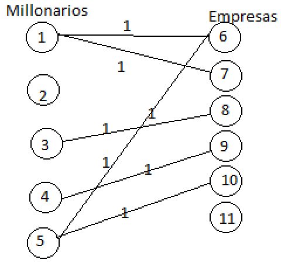
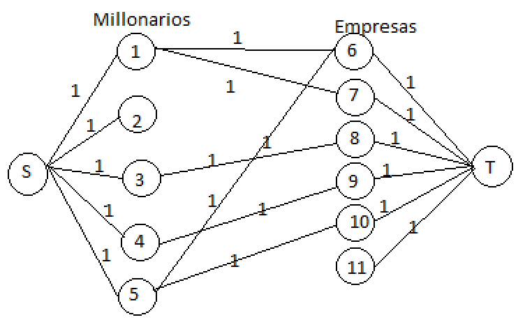

<h1 align="center">Problem J</h1>
<h2 align="center">Jeffrey’s Ambition</h2>

<p>
  <h3>Información del problema</h3>
  El problema nons narra sobre la existencia de un hombre sospechosamente muy millonario, tanto así que tiene la capacidad de comprar todas las empresas que quiera, no 
  obstante al prueblo le parece injusto que este tipo pueda ser dueño de todo y se llega a la conclusión de que cada millonario tenga la oportunidad de crear una lista 
  de las empresas que desean adquirir, tal que de esas empresas solo puedan escoger una. 
  
  
  De esta manera cada millonario sería dueño de una empresa, no obstante se observa que puede darse el caso donde no todas las empresas existentes sean compradas y se 
  queden sin dueño. Por lo cual la tarea es minimizar la cantidad de empresas que se queden sin dueño.
  
  <h3>Interpretación</h3>
  Primero se podría pensar una solución con DP, pero una mejor solución es viendo esto como un grafo, tal vez suene raro pero esto es un problema de emparejamiento en
  grafos bitartitos, por lo cual puede resolver por medio de un algoritmo de Flujo máximo debido a que una de las aplicaciones era sobre grafos bitartitos.
  
  Para entender esta idea hay que pensar que tenemos a dos grupos.
  1. Millonarios 
  2. Empresas
  
  Tal que podemos ver que tenemos que relacionar un millonario a una sola empresa, tal que no puede existir:
  1. Un millonario con dos empresas.
  2. Una empresa con dos dueños.
  
  Entonces observamos que se debe de relacionar un grupo con otro, y esto simmplifica varias cosas debido a que el problema ahora se reduce en relacionar la mayor cantidad de millonarios con empresas tal que se cumplan las dos condiciones colocadas anteriormente, esto es un problema de emparejamiento.
  
  Ahora, ¿de dónde sale el flujo? Bueno, para esto se recuerda que existe el flujo unitario (flujo de 1) tal que en cada arista vamos a tener una capacidad de 1, es de este modo que sabemos que los millonarios es un grupo de vértices mientras que las empresas es otro grupo de vértices. Hasta el momento tenemos dos grupos de vértices los cuales serán unidos con aristas con una capacidad de flujo de 1.
  
  Lo siguiente es observar la necesidad de tener dos vértices más, source and target, estos dos vértices serán colocados en los extremos horizontales del grafo con el objetivo de emplear un algoritmo de flujo siendo un flujo que salga del source y llegue hasta el target, por lo cual con esto podemoss ver ya un grafo tal que nos interese el flujo máximo que llegue al target. Como la capacidad de flujo de cada arista es de 1 (capacidad unitaria) solo se estará sumando 1 en 1 el flujo que se vaya acumulando tal que el flujo máximo encontrado será la misma cantidad de millonarios que compraron una empresa tal que al restar la cantidad de estas relaciones con la cantidad de empresas que existen se obtiene como resultado la mínima cantidad de empresas que se quedaron sin dueño. 
  
  Es de este modo que el problema es posible resolverlo empleando flujo máximo.
  
  <hr>
  Una vez que fue entendido que el problema se puede resolver de este modo ya solo queda la implementación, para esto es posible usar el algoritmo de Dinic el cual es imprescindible a la hora de resolver problemas de flujo y es recomendable tenerlo siempre a la mano lo cual se debe a que es un algoritmo que nos permite hallar el flujo máximo en un tiempo polinomial, sin depender de la capacidad de flujo de las aristas.

<h3>Detalles de implementación</h3>
Al momento de realizar la implementación se deberá tener en mente que se desea lograr lo siguiente: <br><br>
<p align="center">
  
</p>
Por lo cual, lo dado en el input será justamente esto siendo que únicamente se debe de crear la arista que vaya del vértice que representa al millonario hacia al vértice que representa empresa, tal que dicha empresa sea la deseada por el millonario, y la capacidad de la arista es la unitaria. 
Es immportante notar el 'id' o nombre de cada vértice debido a que para no causar choque de estos deberá debe ser diferente el nombre de los millonarios con el nombre de las empresas, de igual forma debe ser diferente el id o nombre del source & target para no causar choques en el algoritmo.

Lo siguiente será ver que para convertir esto en un grafo de flujo será necesario tener una fuente  (source) y un objetivo (target), tal que el flujo que llegue al target hasta llegar un flow block será considerado como el flujo máximo. Entonces el otro punto es crear aristas que vaya del source hacía todos los millonarios, y de igual forma crear aristas que vayan de las empresas al target.
<p align="center">
  
</p>
Ya lo demás se encarga directamente el algoritmo de Dinic, es simplemente su aplicación y ya está.

Finalmente, la interpretación del flujo máximo será la cantidad de emparejamientos de millonarios con una única empresa se pudieron realizar, por lo cual al final se tendrá que restar ese flujo con la cantidad de empresas totales para obtener el número de empresas que se quedaron sin dueño, y esta vendría siendo la respuesta.
</p>

### Implementación

```c++
#include <bits/stdc++.h>
using namespace std;


// Dinic Algorithm Implementation C++

// Arista que va unir u (vértice anterior) - v (vértice siguiente)
struct edge{
    int u,v,time;
    edge(int v, int u, int time) : v(v), u(u), time(time){}
};
// Arista con las características de flujo
struct flowEdge{
    int v,u;
    long long capacity, flow=0;
    flowEdge(int v, int u, long long capacity) : v(v), u(u), capacity(capacity) {}
};


// Dinic
struct Dinic{

  // Atributos para BFS:
  long long flow_inf = 1e18;
  vector<flowEdge> edges; // vector de Aristas
  vector<vector<int>> listAdj; // Lista de adyacencia de 2 dimensiones
  
  int n,m=0,s,t;
  vector<int> level,ptr;
  queue<int> q;
  
  Dinic(int n, int s, int t) : n(n), s(s), t(t) {
    listAdj.resize(n);
    level.resize(n);
    ptr.resize(n);
  }
  
  
  // Función para añadir arista:
  void addEdge(int v, int u, long long capacity){
    edges.emplace_back(v,u,capacity); // Es usada emplace_back para ir agregando tal que se hace realloc
    edges.emplace_back(u,v,0);        // De regreso - para bfs supongo
     
    listAdj[v].push_back(m);
    listAdj[u].push_back(m+1);
    
    m+=2;
  }
  
  // Construcción de level graph usando el graph residual con bfs
  bool bfs(){
    
    while(!q.empty()){
        int v = q.front();
        q.pop();
        
        // Ahora se revisa los vecinos del vértice 
        for(int id : listAdj[v]){
            // Se verifica la capacidad de flujo de la arista
            if(edges[id].capacity - edges[id].flow <=0) continue;
            
            //Se verifica si ya fue explorado o no
            if(level[edges[id].u] != -1) continue;
            
            level[edges[id].u] = level[v]+1;
            q.push(edges[id].u);
        }
    }
    return level[t] != -1;  // Si ya fue explorado o hasta el último vértice, o sea el target.
  }
  
  
  // Implementacion de DFS
  long long dfs(int v, long long pushed){
        if(pushed == 0) return 0;
        
        if(v==t) return pushed;
        
        for (int& cid = ptr[v]; cid < (int)listAdj[v].size(); cid++) {
            int id = listAdj[v][cid];
            int u = edges[id].u;
            if (level[v] + 1 != level[u] || edges[id].capacity - edges[id].flow <= 0)
                continue;
            long long tr = dfs(u, min(pushed, edges[id].capacity - edges[id].flow));
            if (tr == 0)
                continue;
            edges[id].flow += tr;
            edges[id ^ 1].flow -= tr;
            return tr;
        }
        return 0;
   }
  
    // 
    long long flow() {
        long long f = 0;
        while (true) {
            fill(level.begin(), level.end(), -1);
            level[s] = 0;
            q.push(s);
            if (!bfs())
                break;
            fill(ptr.begin(), ptr.end(), 0);
            while (long long pushed = dfs(s, flow_inf)) {
                f += pushed;
            }               
        }
        return f;
    }
};


int main() {
	// your code goes here
	
    // Se necesita de un source y target
    int source=0, target=0;
    // Millonarios y compañias
    int p,c; cin>>p>>c;
    
    int n = p+c; // Cantidad de vértices 
    
    // Creación de dinic
    source+=(n+1);
    target+=(n+2);
    Dinic dn = Dinic(n+3, source, target);
    
    // Realizando las uniones de aristas de millonarios con empresas
    int k; // Tamaño de lista
    int e; // Empresa
    
    for(int i=1;i<=p;i++)   // i sería el empresario
        {
            cin>>k;
            
            for(int j=0;j<k;j++){
                cin>>e;
                dn.addEdge(i,p+e, 1);    // Para que los números no choquen las empresas 
            }                           // su id será desde los millonarios. 
        }
    
    //Uniendo los millonarios con el source
    for(int i=1;i<=p;i++)
        {
            dn.addEdge(source, i, 1);
        }
    
    // Uniendo las empresas con el target
    for(int i=1;i<=c;i++)
        {
            dn.addEdge(p+i, target, 1);
        }
    
    //Solución.
    long long flow = dn.flow();
    cout<<c-flow;
    
	return 0;
}


```
